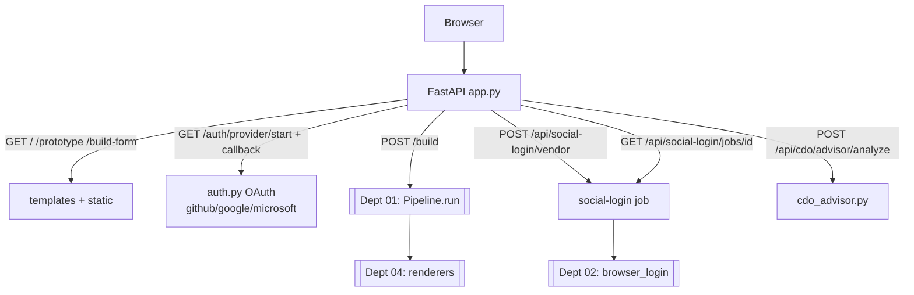

# `web/` — FastAPI service and legacy CareerLens UI

> **Frontend ownership:** `apps/portal` is the canonical product entry point, backed by the
> feature packages under `domains`. This package owns the
> local API, automation services, and temporary legacy/developer pages. New product UI must be
> implemented in Next.js. Set `PYTORCH_PH_FRONTEND_URL=http://127.0.0.1:3100` during cutover so
> legacy entry routes redirect to their canonical replacements.

The service layer wraps the pipeline, OAuth identity, job automation, and analytics APIs. Jinja
pages remain available only for incremental migration and development inspection. **Department 05.**

> 📖 [Dept 05 — Web / SaaS](../../../../docs/departments/05-web-saas/README.md)
> ⚠️ Prototype: **no user DB, no billing, no rate limiting yet.**

## Request flow

## Files

| File | Role |
|---|---|
| `app.py` | FastAPI routes (pages, auth, build, social-login, advisor, healthz) |
| `auth.py` | `WebAuthSettings` — GitHub/Google/Microsoft OAuth (`read:user`, `user:email`) |
| `cdo_advisor.py` | Resume injection / compliance analysis |
| `mock_data.py` | Prototype fixtures |
| `dev_server.py` | Local dev server |
| `templates/` | Jinja2 HTML |
| `static/` | CSS / JS |

## Rules

- **Don't fork the engine — call it.** `/build` is a thin adapter to `Pipeline.run()`.
- OAuth is **identity, not authorization-to-act** (don't expand scopes without a product call).
- Secrets via env only (see `docs/web-auth-setup.md`).
- Long/interactive logins run as **jobs** (start → poll), never block a request thread.
- Validate all request bodies; treat advisor input + uploads as untrusted.
